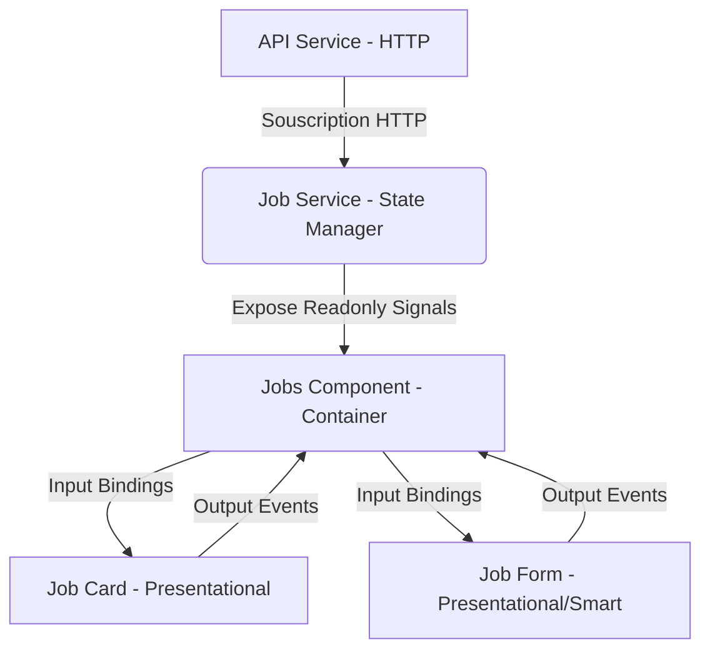

# UI/UX Scope Professionnel : Frontend Premium avec Angular & PrimeNG

Ce guide définit les standards, l'architecture et les directives UI/UX pour transformer une application Angular standard en un produit de niveau **Entreprise / Premium**. Nous utiliserons **PrimeNG** (v18+) couplé à du **Vanilla CSS (Custom Properties)** pour un contrôle total sur l'esthétique, l'accessibilité et la performance.

---

## 🎨 1. Design System & Charte Graphique

Un design professionnel repose sur une cohérence visuelle parfaite. Voici les spécifications du design system à implémenter.

### Palette de Couleurs (Thème Sombre & Lumineux)
Nous utilisons des variables CSS (custom properties) pour gérer dynamiquement le basculement de thème (Dark/Light mode).

```css
:root {
  /* Mode Clair (Premium Light) */
  --bg-primary: #f8fafc;
  --bg-surface: #ffffff;
  --text-main: #0f172a;
  --text-muted: #64748b;
  --border-color: #e2e8f0;
  
  /* Accentuation */
  --primary: #6366f1; /* Indigo */
  --primary-hover: #4f46e5;
  --accent: #14b8a6; /* Teal */
  
  /* Status */
  --status-wishlist: #3b82f6; /* Bleu */
  --status-applied: #f59e0b; /* Ambre */
  --status-interview: #8b5cf6; /* Violet */
  --status-offer: #10b981; /* Émeraude */
  --status-rejected: #ef4444; /* Rouge */
}

[data-theme="dark"] {
  /* Mode Sombre (Deep Slate) */
  --bg-primary: #090d16;
  --bg-surface: #111827;
  --text-main: #f8fafc;
  --text-muted: #94a3b8;
  --border-color: #1f2937;
}
```

### Typographie
* **Police principale** : `Inter` ou `Outfit` via Google Fonts.
* **Échelle typographique** :
  * `h1`: 2.25rem (Bold, Tracking-tight)
  * `h2`: 1.5rem (Semi-Bold)
  * `body`: 0.95rem (Regular, Line-height 1.6)
  * `small`: 0.8rem (Medium, Uppercase pour les labels)

---

## 🏗️ 2. Choix de la Librairie : PrimeNG (v18+)

### Pourquoi PrimeNG ?
1. **Architecture moderne** : Support natif et performant des signaux Angular.
2. **Modularité** : Composants standalone hautement configurables.
3. **Thématisation unifiée** : Gestion simplifiée des styles via le nouveau moteur de thème (Lara / Aura).

### Composants Pro à implémenter :
* **Navigation** : `p-menubar` responsive pour le header principal, et `p-sidebar` pour le menu mobile.
* **Formulaires** : `p-inputtext`, `p-dropdown` pour la sélection de statuts, `p-calendar` pour les dates, et `p-inputnumber` stylisé pour le salaire.
* **Affichage des données** : `p-tag` pour les badges de statuts, `p-card` pour la présentation moderne, et `p-toast` pour les notifications globales.
* **Feedback visuel** : `p-skeleton` pour les états de chargement (Shimmer Effect).

---

## ⚡ 3. UX & Micro-Animations

L'expérience utilisateur (UX) haut de gamme repose sur des interactions fluides et intuitives.

### Règles d'or de l'interaction :
1. **Shimmer/Skeleton Loaders** : Remplacer les spinners de chargement classiques par des blocs Shimmer reproduisant la structure de la carte ou de la table pendant la récupération des données.
2. **Transitions d'états** :
   ```css
   .interactive-element {
     transition: all 0.2s cubic-bezier(0.4, 0, 0.2, 1);
   }
   .interactive-element:hover {
     transform: translateY(-2px);
     box-shadow: 0 10px 15px -3px rgba(99, 102, 241, 0.1);
   }
   ```
3. **Animations Angular (`@angular/animations`)** :
   * Animation d'entrée progressive (fade-in-up) pour l'apparition des cartes dans la liste.
   * Animation de glissement pour l'ouverture du formulaire d'édition.

---

## 🗄️ 4. Architecture de State & Signals (Clean Front)

Pour structurer le code comme un professionnel de l'écosystème Angular :



### Directives d'implémentation du State :
* **Unidirectional Data Flow** : Les composants enfants (`JobCard`, `JobForm`) ne doivent jamais modifier l'état directement. Ils émettent des évènements (`@Output`) que le composant parent (`Jobs`) capture pour solliciter le service.
* **Calculs dérivés réactifs** : Utilisation intensive de `computed()` pour les statistiques et les filtres de recherche sans jamais déclencher de cycles de détection manuels (`ChangeDetectorRef` est banni).

---

## 🎯 5. Programme d'Apprentissage (Checkpoints)

Voici la feuille de route pour monter en compétences et implémenter cette UI pro :

- [x] **Feature 5.1 : Configuration & Thème**
  * Installer PrimeNG et configurer les polices Google Fonts.
  * Mettre en place les variables de thème globales et le toggle Dark/Light.
- [x] **Feature 5.2 : Layout & Shimmer**
  * Créer le layout principal avec une barre de navigation fixe et un effet de flou en arrière-plan (glassmorphism).
  * Créer un composant Skeleton Shimmer pour la liste des offres en attente de chargement.
- [x] **Feature 5.3 : Cartes Premium & Animations**
  * Refondre les cartes d'offres avec PrimeNG `p-card` et des micro-interactions au survol.
  * Implémenter l'animation de chargement des cartes avec `@angular/animations`.
- [ ] **Feature 5.4 : Formulaires Avancés & Modals**
  * Remplacer le formulaire en ligne par un panneau latéral (`p-sidebar` ou dialog PrimeNG) glissant avec un design aéré et des validations en temps réel esthétiques.
- [ ] **Feature 5.5 : Notifications & Toasts**
  * Configurer le service de toast de PrimeNG (`MessageService`) pour notifier de manière élégante chaque succès/erreur d'action CRUD.
